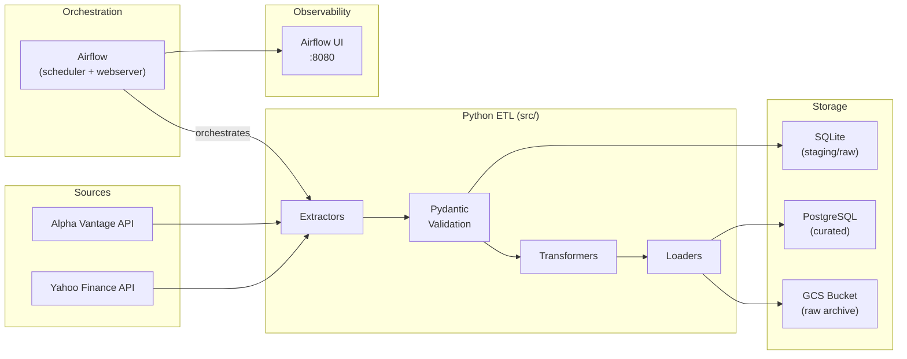

# P-01: Financial Markets Daily Pipeline

[](https://github.com/ale-camer/financial-markets-pipeline/actions/workflows/ci.yml)
[](https://github.com/ale-camer/financial-markets-pipeline/actions/workflows/cd.yml)

A daily batch data pipeline that extracts stock prices and fundamental data from Yahoo Finance and Alpha Vantage, validates ingestion schemas using Pydantic, stores raw/staging data in SQLite, and loads curated analytical data into PostgreSQL. The entire workflow is containerized using Docker, orchestrate by Apache Airflow, and verified via GitHub Actions CI/CD workflows.

---

## 📐 System Architecture



---

## 🗄️ Database Layers & Schema Progression

1. **Raw Layer (SQLite)**: Stores raw JSON responses directly from APIs with an ingestion timestamp to maintain data lineage and reproducibility.
2. **Staging Layer (SQLite)**: Implements strong contract enforcement using Pydantic models. Data is typed, structured, and cleaned, but not structurally modified.
3. **Curated Layer (PostgreSQL)**: Normalizes data into dimension and fact tables optimized for analytical queries (e.g., `dim_companies`, `fct_daily_prices`, `fct_dividends`).

---

## 🚀 Quick Start (Local Setup)

### 1. Prerequisites
- Docker & Docker Compose
- `make` CLI

### 2. Configure Environment Variables
Copy the template and fill in your details (especially the Alpha Vantage API key):
```bash
cp .env.example .env
```

### 3. Spin Up Services
```bash
make up
```
This command builds the custom Airflow Docker image, starts the PostgreSQL database, and initializes Airflow database schemas and an admin user.

### 4. Access Airflow UI
Go to [http://localhost:8080](http://localhost:8080) and log in with:
- **Username**: `admin`
- **Password**: `admin`

---

## 🛠️ Makefile Commands Reference

- `make up` - Start the local containerized environment.
- `make down` - Stop the containers and clean up.
- `make restart` - Restart the services.
- `make logs` - Follow container logs.
- `make lint` - Run ruff checking on Python source files.
- `make test` - Run pytest tests.

---

## 🚧 Status
**Under Construction** — Part of the DE → AIE portfolio progression.
For details on architecture decisions, see [docs/architecture.md](docs/architecture.md).
For data dictionary, see [docs/data_dictionary.md](docs/data_dictionary.md).
