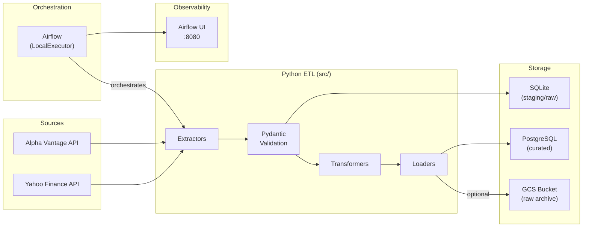

# P-01: Financial Markets Daily Pipeline

[](https://github.com/ale-camer/financial-markets-pipeline/actions/workflows/ci.yml)
[](https://github.com/ale-camer/financial-markets-pipeline/actions/workflows/cd.yml)

A production-grade daily batch data pipeline that extracts stock market prices and fundamental company metadata from Yahoo Finance and Alpha Vantage APIs, validates data contracts using Pydantic, stores raw & staging data in SQLite, optionally archives raw JSON payloads to Google Cloud Storage (GCS), and loads curated analytical data into PostgreSQL. 

Orchestrated with **Apache Airflow**, fully containerized with **Docker**, and continuously verified via **GitHub Actions CI/CD**.

---

## 📐 System Architecture



---

## 🗄️ Database Layers & Data Progression

1. **Raw Layer (SQLite / GCS)**: Preserves unmodified JSON payloads from APIs with UTC extraction timestamps for lineage, auditing, and re-processing. Optionally streams raw payloads to a Google Cloud Storage bucket (`GCS_BUCKET_NAME`).
2. **Staging Layer (SQLite)**: Enforces strict data contracts using Pydantic validation models (`YFinanceOHLCVRecord`). Filters invalid records, validates price logic constraints, and standardizes data structures.
3. **Curated Layer (PostgreSQL)**: Normalizes data into star-schema analytical tables optimized for query performance:
   - `dim_companies`: Dimension table with company sector, industry, and currency metadata.
   - `fct_daily_prices`: Fact table with daily price metrics (`open`, `high`, `low`, `close`, `volume`).
   - `fct_dividends`: Fact table capturing dividend distributions and stock split ratios.

---

## 🚀 Quick Start (Local Setup)

### 1. Prerequisites
- Docker Engine & Docker Compose
- `make` CLI

### 2. Configure Environment Variables
Copy the template and configure your local credentials:
```bash
cp .env.example .env
```

Ensure your `.env` contains:
```properties
# Alpha Vantage API Key
ALPHA_VANTAGE_API_KEY=your_api_key_here

# GCS Archiving (Optional)
GCS_BUCKET_NAME=your-gcs-bucket-name
GOOGLE_APPLICATION_CREDENTIALS=/app/config/gcp-credentials.json
```

### 3. Spin Up Services
```bash
make up
```
This command builds the custom Airflow Docker container, starts PostgreSQL, runs database migrations, and initializes the Airflow admin user.

### 4. Access Airflow UI
Open your browser at [http://localhost:8080](http://localhost:8080) and log in:
- **Username**: `admin`
- **Password**: `admin`

Unpause and trigger the DAG **`financial_market_daily_pipeline`**.

---

## 🛠️ Makefile Commands Reference

| Command | Description |
|:---|:---|
| `make up` | Build and start the containerized environment. |
| `make down` | Stop containers and remove networks. |
| `make restart` | Restart all services. |
| `make logs` | Stream logs from all running containers. |
| `make lint` | Run code quality & style checks via `ruff`. |
| `make test` | Run unit and integration tests via `pytest`. |

---

## 📚 Documentation & Reference

- **[Contributing Guidelines](CONTRIBUTING.md)**: Git branch naming, issue linking, and PR conventions.
- **[Architecture Decisions (ADR)](docs/architecture.md)**: Technical rationale behind multi-DB ingestion, Pydantic validation, Airflow configuration, and GCS archiving.
- **[Data Dictionary](docs/data_dictionary.md)**: Detailed database schemas, data types, business rules, and constraints across Raw, Staging, and Curated layers.
- **[End-to-End Walkthrough](docs/walkthrough.md)**: Step-by-step guide to running, monitoring, and verifying the pipeline execution.

---

## 🚧 Portfolio Status
Part of the **Data Engineering → AI Engineering** career progression portfolio. Designed for scalability, resilience, and strict data quality enforcement.
