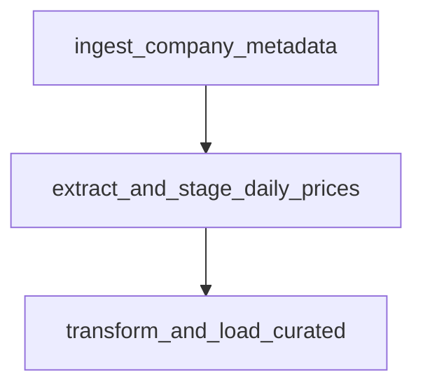

# End-to-End Project Walkthrough — P-01

This walkthrough provides a step-by-step guide to executing, observing, and verifying the **Financial Markets Daily Pipeline**.

---

## 🔄 DAG Overview & Execution Order

The main orchestration DAG is `financial_market_daily_pipeline`. It consists of three sequential tasks:



### Task 1: `ingest_company_metadata`
- **Goal**: Fetches company profile metadata (Name, Sector, Industry, Currency) for configured stock tickers.
- **Data Source**: Primary extraction from **Alpha Vantage API** with fallback to local static metadata if API rate limits are hit.
- **Target**: Inserts or updates dimension records in PostgreSQL (`dim_companies`).

### Task 2: `extract_and_stage_daily_prices`
- **Goal**: Extracts historical daily price points (OHLCV), dividend events, and stock splits.
- **Data Source**: **Yahoo Finance API** (`yfinance`).
- **Validation**: Enforces strict Pydantic schemas (`YFinanceOHLCVRecord`).
- **Raw Storage**:
  - Inserts raw JSON payload into **SQLite** (`raw_data` table).
  - *Optional*: Streams raw JSON payloads to **Google Cloud Storage (GCS)** if GCP credentials are configured.
- **Staging Storage**: Inserts validated records into **SQLite** (`staging_prices` table).

### Task 3: `transform_and_load_curated`
- **Goal**: Reads validated data from SQLite staging, applies transformation logic, and upserts facts into the curated PostgreSQL database.
- **Target**:
  - Upserts daily prices into `fct_daily_prices`.
  - Upserts corporate actions into `fct_dividends`.

---

## 🛠️ Step-by-Step Execution Guide

### 1. Environment Setup
Make sure your `.env` file is present in the project root:
```bash
cp .env.example .env
```

### 2. Start Services
Launch the containerized environment using the Makefile:
```bash
make up
```

Wait until all containers are healthy:
- `financial-pipeline-postgres` (PostgreSQL 15)
- `financial-pipeline-airflow-webserver` (Airflow 2.10.5 Web UI)
- `financial-pipeline-airflow-scheduler` (Airflow Scheduler)

### 3. Trigger Pipeline in Airflow
1. Open your browser and navigate to [http://localhost:8080](http://localhost:8080).
2. Log in with `admin` / `admin`.
3. Locate `financial_market_daily_pipeline`.
4. Toggle the DAG switch to **Active** (blue).
5. Click the **Play / Trigger** button to start a manual run.

---

## 🔍 Data Verification

### 1. Verifying PostgreSQL Curated Tables
You can inspect the curated analytics database using `docker exec`:

```bash
# Query dimension table
docker exec -it financial-pipeline-postgres psql -U airflow -d market_data -c "SELECT * FROM dim_companies;"

# Query price facts
docker exec -it financial-pipeline-postgres psql -U airflow -d market_data -c "SELECT ticker, date, close, volume FROM fct_daily_prices LIMIT 10;"

# Query dividend facts
docker exec -it financial-pipeline-postgres psql -U airflow -d market_data -c "SELECT * FROM fct_dividends;"
```

### 2. Verifying SQLite Staging Tables
Inspect the local SQLite database (`data/market_data.db`):

```bash
sqlite3 data/market_data.db "SELECT count(*) FROM raw_data;"
sqlite3 data/market_data.db "SELECT ticker, date, close FROM staging_prices LIMIT 10;"
```

### 3. Verifying GCS Raw Archives (Optional)
If GCP credentials are set, check the GCS bucket for raw JSON payloads:

```bash
gcloud storage ls -r gs://<YOUR_BUCKET_NAME>/raw_data/
```

---

## 🛡️ Error Handling & Fault Tolerance

- **API Rate Limiting**: Alpha Vantage rate limits are handled gracefully with built-in retry backoff and fallback.
- **Optional GCS Archiving**: If GCP credentials are not provided or GCS is unreachable, the pipeline logs a warning and proceeds without breaking database ingestion.
- **Schema Validation**: Any API payload violating logical constraints (e.g., negative prices or invalid volume) is rejected before reaching staging.
